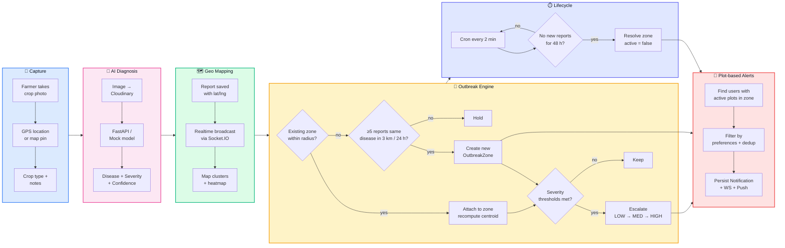

# Geo Mapping & Outbreak Intelligence — Flow

This document captures the end-to-end flow for the hackathon PPT. Three formats are included:

1. **Horizontal Mermaid flow chart** — renders directly in PowerPoint via the Mermaid plugin, in Notion, GitHub, or via [mermaid.live](https://mermaid.live) where you can export as PNG/SVG.
2. **ASCII horizontal diagram** — drop straight into a slide as a code block / monospace text.
3. **Step-by-step narrative** — slide-notes friendly, with the exact thresholds and timings.

---

## 1. Horizontal Mermaid flow chart (recommended for PPT)

Paste this into [mermaid.live](https://mermaid.live), export as PNG or SVG, drop into your slide.



---

## 2. ASCII horizontal flow (paste-ready)

Use a monospace font in the slide (Consolas / Menlo / JetBrains Mono). Width ≈ 130 cols.

```
┌──────────────┐    ┌──────────────┐    ┌──────────────┐    ┌────────────────────┐    ┌──────────────────┐
│   CAPTURE    │───▶│   AI MODEL   │───▶│   GEO MAP    │───▶│  OUTBREAK ENGINE   │───▶│  PLOT  ALERTS    │
├──────────────┤    ├──────────────┤    ├──────────────┤    ├────────────────────┤    ├──────────────────┤
│ Photo        │    │ Cloudinary   │    │ lat / lng    │    │ ≥5 reports         │    │ Match users by   │
│ GPS / pin    │    │ FastAPI      │    │ Postgres     │    │ within 3 km / 24h  │    │ active plots     │
│ Crop type    │    │ Severity     │    │ Socket.IO    │    │  → CREATE zone     │    │ Filter prefs     │
│ Notes        │    │ Confidence   │    │ Supercluster │    │  → ATTACH report   │    │ 24h dedup        │
│              │    │ Recommend.   │    │ Heatmap      │    │  → ESCALATE sev    │    │ Persist + WS +   │
│              │    │              │    │              │    │  → RESOLVE @ 48h   │    │ Expo Push        │
└──────────────┘    └──────────────┘    └──────────────┘    └────────────────────┘    └──────────────────┘
       │                   │                   │                     │                         │
       ▼                   ▼                   ▼                     ▼                         ▼
   Mobile UI           Mock or real       Live markers        Centroid drifts            In-app banner
   (Expo)            ML provider          + outbreak             toward density          + Bell badge
                     env-swappable        circles                of new reports         + OS push
```

---

## 3. Compact one-liner (for a sub-title slide)

> **Photo + GPS → AI diagnosis → Geo store → Outbreak engine clusters reports into zones → Plot-based notifications → Live map + push.**

---

## 4. Step-by-step narrative (slide notes)

### Stage 1 — Capture (mobile)
- Farmer opens the **Upload** tab, takes/picks a photo.
- App grabs **GPS** (or farmer drops a pin on the map).
- Farmer selects crop from a 25-crop catalog and adds optional notes.
- Image is compressed (≤1600 px, JPEG q=0.7) on-device.

### Stage 2 — AI diagnosis (server-side, async)
- Image goes **direct to Cloudinary** via a server-signed signature.
- Backend creates a `Report` row with `processingStatus = PENDING` and **returns immediately**.
- `ReportsProcessor` (fire-and-forget) calls `AiService` → routes to `MockAiClient` or `FastApiAiClient` based on `AI_PROVIDER` env.
- On success: `Report` is updated with `disease`, `confidence`, `severity` (LOW/MED/HIGH), `recommendations`, `processedAt`. Mobile polls `/reports/:id` every 3 s.

### Stage 3 — Geo mapping
- Report row carries **lat / lng + Postgres index** for fast spatial queries.
- Backend emits `report.created` over Socket.IO globally; throttled `map.updated` tick (≤1/5 s) signals the map to refresh.
- Mobile map screen consumes `GET /reports/nearby?lat&lng&radiusKm` (bounding-box + haversine refinement) and **clusters** points client-side via Supercluster.
- Severity-weighted **heatmap** layer is available as a toggle.
- Markers, clusters, outbreak circles, and the user's own plots all render simultaneously.

### Stage 4 — Outbreak Engine
After AI success, `OutbreakProcessor.handleNewReport(report)` runs:

1. **Find matching zone** — bbox + haversine query for an active zone of the same disease within its radius.
   - **If found** → `attachToZone`: running-average centroid, increment counts, recompute severity, broaden radius if needed.
   - **If not** → check creation rule.
2. **Creation rule** — if **≥ 5 SUCCESS reports** of the same disease exist within **3 km in the last 24 h**, create a fresh zone centered on the centroid of those reports.
3. **Severity rule** — `LOW` until **10 reports** (`MEDIUM`), then `HIGH` at **20 reports** OR **5 HIGH-severity contributing reports**.
4. Emit `outbreak.created` / `outbreak.updated` over Socket.IO; `map.updated` tick.
5. All thresholds are env-tunable (`OUTBREAK_CREATE_THRESHOLD`, `OUTBREAK_CREATE_RADIUS_KM`, etc.).

### Stage 5 — Lifecycle
- `OutbreakScheduler` runs every **2 minutes** via `@nestjs/schedule`.
- Any zone with `lastSeenAt` older than **48 h** is marked `active = false` and `outbreak.resolved` is emitted.
- A startup sweeper also resets stuck `PROCESSING` reports back to `PENDING` so a process crash mid-AI is recoverable.

### Stage 6 — Plot-based alerts
- `NotificationsFanoutService` is the single integration point. For each engine event:
  - **Geographic match** — find users whose **active plots** sit inside `zone.radius + 5 km buffer` (NOT the user's live location — explicit privacy choice).
  - **Preferences filter** — drop users who disabled this category.
  - **Dedup** — skip if the same user was notified about the same `outbreakId` in the last 24 h.
  - **Persist** one `Notification` row per recipient.
  - **Deliver** via Socket.IO to the per-user room (`user:${userId}`) AND via **Expo push** for backgrounded apps.
- Mobile receives the WS event → in-app banner slides in (max 3 stacked) → tab-bar bell badge increments → entry appears in the feed.

### Stage 7 — Closing the loop
- Tapping a banner / notification deep-links to the **outbreak detail sheet** on the map or to the originating **report screen**.
- The detail sheet shows the zone circle, contributing reports, affected crops, severity, last-seen time, and prevention guidance.

---

## 5. Numbers to call out in the PPT

| Metric | Value |
|---|---|
| Outbreak creation threshold | **5 reports / 3 km / 24 h** |
| MEDIUM severity threshold | **10 reports** |
| HIGH severity threshold | **20 reports OR 5 HIGH-severity reports** |
| Resolution window | **48 h with no new reports** |
| Scheduler cadence | **every 2 minutes** |
| Notification dedup window | **24 h per (user, outbreak)** |
| Notification target | **Active farmer plots within zone.radius + 5 km buffer** |
| Realtime channel | **Socket.IO with per-user rooms** |
| Push channel | **Expo push (anonymous tier OK for demo)** |

---

## 6. One-slide summary line (use as the slide title or footer)

> **From a single photo to a live outbreak alert — in seconds.**
> *Capture → AI → Geo store → Cluster engine → Plot-based push.*
