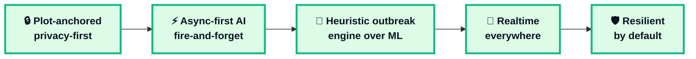
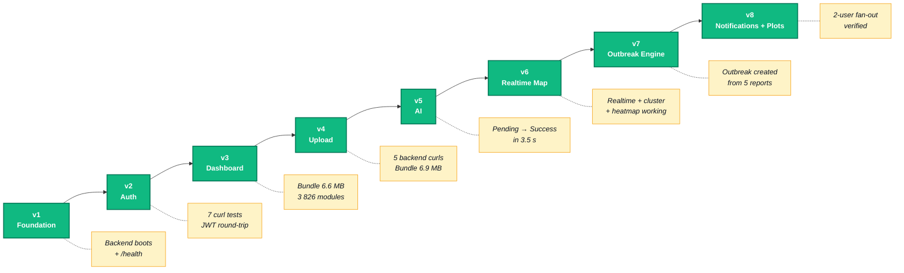
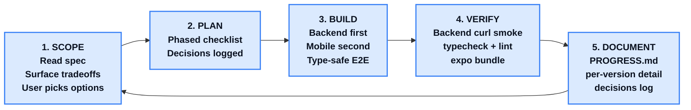

# Methodology & Implementation Workflow

PPT-ready content for the hackathon deck. Three formats per section: Mermaid diagram (for export to PNG/SVG), narrative bullets, and a numbers/decisions table.

---

## Methodology

### A. Five-pillar slide

A single slide with five design pillars. Pick one as the headline pillar (we suggest "Plot-anchored").

#### Pillar 1 — Plot-anchored, privacy-first
Notifications target **registered farmer plots**, not live user location.
- No background GPS tracking, no battery drain
- Explicit consent, multi-plot ready
- Anchor for future district analytics

#### Pillar 2 — Async-first AI
Disease detection runs **fire-and-forget** in the background.
- `POST /reports` returns in ~50 ms (not 25 s)
- Mobile polls `/reports/:id` every 3 s while `processingStatus ∈ {PENDING, PROCESSING}`
- Provider abstraction (`AI_PROVIDER=mock | fastapi`) — single env flag swaps mock to real ML

#### Pillar 3 — Heuristic outbreak engine
Rule-based clustering with explicit, env-tunable thresholds.
- 5 reports / 3 km / 24 h → create
- 10 reports → MEDIUM, 20 reports OR 5 HIGH → HIGH
- 48 h silence → resolve
- Architecture cleanly supports an ML swap later (single `handleNewReport` interface)

#### Pillar 4 — Realtime everywhere
Socket.IO with **per-user rooms** for targeted delivery.
- Global broadcasts: `report.created`, `outbreak.{created, updated, resolved}`, throttled `map.updated`
- Per-user broadcasts: `notification.{created, read, deleted}`
- Foreground in-app banner via WS, background OS notification via Expo push

#### Pillar 5 — Resilient by default
Failure paths designed-in, not bolted-on.
- Offline upload queue with exponential backoff (1m → 5m → 15m → 1h → 6h)
- Startup sweeper recovers crashed `PROCESSING` rows
- Cron sweeps stale outbreaks every 2 min
- Push failures silent; WS + persisted Notification always succeed

---

### B. Methodology Mermaid (paste into [mermaid.live](https://mermaid.live))

---

### C. Trade-offs we explicitly chose

| We chose | Over | Why |
|---|---|---|
| Plot registration | Live location tracking | Privacy + multi-plot support |
| Async AI + polling | Sync request | 25 s upstream can't block HTTP |
| Heuristic clustering | ML model | Hackathon scope; engine is swappable |
| Per-user rooms | Global broadcasts | Targeted notifications without district modeling |
| Pre-create notification rows | Lazy compute | Simple unread tracking + offline cache |
| Soft-delete plots | Hard delete | Preserves notification provenance |
| Mock OTP / mock AI behind env flag | Real provider | Demo-stable; swap is one env var |
| Direct Cloudinary upload | Backend proxy | No bandwidth doubling; secret stays server-side |
| Supercluster | `react-native-map-clustering` | Latter is abandoned; we own the ~80-line glue |
| Pure Reanimated | Lottie / Moti | Zero new deps for everything we needed |

---

## Implementation Workflow

### D. Eight phased versions

A horizontal phased timeline with 8 versions, each with one verb + one noun. Verification gates beneath as a footer band.

#### v1 — Foundation
Monorepo (pnpm + Turborepo) · NestJS + Prisma + Neon · Expo SDK 56 + Expo Router · NativeWind v5 · 8 reusable UI primitives · Socket.IO scaffold

#### v2 — Authentication
Mock OTP (DB-backed, TTL'd) · passport-jwt · Global `JwtAuthGuard` · Zustand auth store · SecureStore + AsyncStorage hydration · Glassmorphism login/OTP screens

#### v3 — Dashboard
5-tab navigation with FAB upload · Glass tab bar · Reusable cards (Outbreak / Report / Stat / Notification) · Skeleton shimmer · Pull-to-refresh

#### v4 — Report Upload
Cloudinary signed direct upload · Image compression (≤1600 px, JPEG q=0.7) · GPS + map picker · 25-crop catalog · Persistent offline queue with exponential backoff

#### v5 — AI Disease Detection
Provider abstraction (`AiClient` interface) · Mock + FastAPI clients · Fire-and-forget `ReportsProcessor` · Animated SVG confidence ring · Reanimated scan-line UI

#### v6 — Realtime Map
`react-native-maps` + Supercluster · Severity-weighted heatmap · WS-driven live updates · Filter sheet · Reusable `disease-analysis` components in detail sheet

#### v7 — Outbreak Engine
Dedicated `OutbreakProcessor` · Running-average centroid · Cron-based deactivation · 4 lifecycle events · `OutbreakDetailSheet` with mini map + contributing reports

#### v8 — Notifications + Plots
Plot model + CRUD · Per-user socket rooms · `NotificationsFanoutService` · Expo push integration · In-app banner stack · Lite onboarding · Tab-bar unread badge

---

### E. Implementation workflow Mermaid

---

### F. Build process per version (the recurring loop)

Every single version followed the same disciplined loop. Worth a dedicated slide — shows the process is professional, not ad-hoc.

#### Why this matters
- Every decision was logged with the alternatives we considered
- Every version was verified against real backend before declaring done
- A new collaborator can read `PROGRESS.md` and immediately understand the state of the system, the debt, and the rationale

---

### G. Verification gates by version (table for footer band)

| Version | Backend gate | Mobile gate |
|---|---|---|
| v1 | `/health` returns `{ db: 'up' }` | 8 components render |
| v2 | 7 auth curls (send-otp / verify / me) | typecheck + bundle |
| v3 | — | 6.6 MB iOS bundle, 3 826 modules |
| v4 | 5 curls (signature, create, list, find) | 6.9 MB bundle |
| v5 | PENDING → SUCCESS in 3.5 s, reprocess works | 6.9 MB bundle |
| v6 | nearby endpoint + WS events fire | 7.0 MB bundle |
| v7 | 11 reports → 1 zone with HIGH severity | 7.0 MB bundle |
| v8 | 2-user fan-out verified end-to-end | 7.2 MB bundle |

---

### H. One-line slide titles

- **Methodology:** *Five pillars: privacy-first, async-first, heuristic-first, realtime, resilient.*
- **Workflow:** *Eight versions, one disciplined loop: scope → plan → build → verify → document.*
- **Build process:** *Every decision logged. Every version verified. Nothing assumed.*

---

## I. Recommended deck slide order

| Slide | Title | Source |
|---|---|---|
| 1 | "Five pillars" — methodology overview | Section A |
| 2 | Trade-offs table | Section C |
| 3 | "Eight phased versions" — implementation timeline | Sections D + E |
| 4 | "Five-step build loop" | Section F |
| 5 | Verification gates table | Section G |
| 6 | (optional) Numbers callout — outbreak thresholds | See `GEO_MAPPING_FLOW.md` § 5 |

---

## J. Tech stack callout (if you have a slide for it)

| Layer | Choice |
|---|---|
| Monorepo | pnpm workspaces + Turborepo |
| Backend | NestJS 10 + Prisma + Postgres (Neon) |
| Auth | passport-jwt + global guard |
| Realtime | Socket.IO with JWT middleware + per-user rooms |
| Image hosting | Cloudinary (signed direct upload) |
| AI | Provider abstraction; FastAPI client + deterministic mock |
| Mobile | Expo SDK 56 + Expo Router with typed routes |
| Styling | NativeWind v5 (Tailwind v4) + glassmorphism |
| State | Zustand (client) + TanStack Query (server) |
| Maps | react-native-maps + supercluster + native heatmap |
| Push | Expo push (anonymous tier) |
| Animations | Pure Reanimated 4 |
| Validation | Zod (env) + class-validator (DTOs) |
