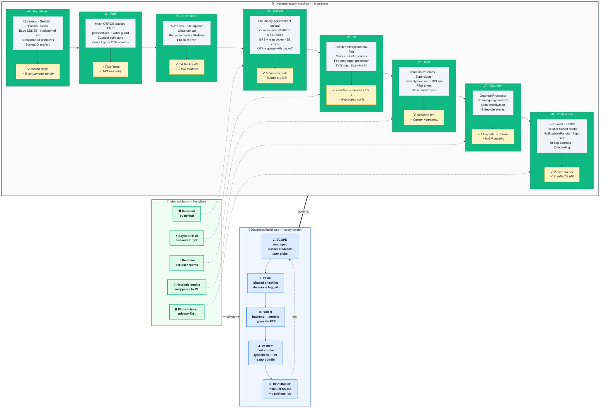
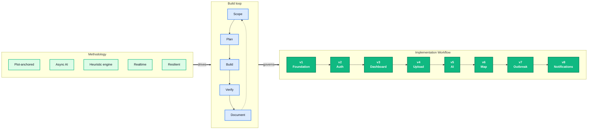

# Methodology + Implementation Workflow — Combined Diagram

A single horizontal Mermaid diagram that captures the methodology pillars, the recurring build loop, and the eight-phase implementation workflow — all connected so the audience sees how the methodology drives the implementation.

Paste into [mermaid.live](https://mermaid.live), export as PNG/SVG, drop into your slide.

---

## Combined horizontal diagram

---

## Reading the diagram

**Left to right flow** (the horizontal narrative):
1. **Methodology** — the five pillars set the design principles
2. **Build loop** — every version is governed by the same disciplined 5-step process
3. **Implementation** — eight versions executed in order, each with its scope and verification gate

**The thick double arrows (`==>`)** show the top-level flow: methodology drives the loop, which governs implementation.

**The dotted arrows (`-.->`)** from pillars to specific versions show which methodology principle most embodies that phase:
- Plot-anchored → v8 Notifications
- Async AI → v5 AI
- Heuristic engine → v7 Outbreak
- Realtime → v6 Map
- Resilient → v4 Upload (offline queue)

---

## Slide presentation tips

- **Aspect ratio:** horizontal layout fits 16:9 slides cleanly. Export at 2× or 3× density for crisp text on projectors.
- **Splitting if needed:** if the full diagram is too wide, the eight versions naturally split into two halves (v1–v4 foundation + features, v5–v8 intelligence + delivery) on consecutive slides while keeping the methodology + loop as a header band.
- **Color legend** (small caption under the diagram on your slide):
  - 🟢 Green — methodology pillars / version titles
  - 🔵 Blue — build loop steps
  - ⚪ Gray — version scope
  - 🟡 Amber — verification gates
- **Talking track** (left to right):
  > "We anchored the system on five methodology pillars. Every version went through the same disciplined five-step loop — scope, plan, build, verify, document. We executed eight versions in order, each with its own scope and verification gate. The dotted arrows show which pillar drove which version most directly."

---

## Compact alternative (if the full one is too dense for one slide)

